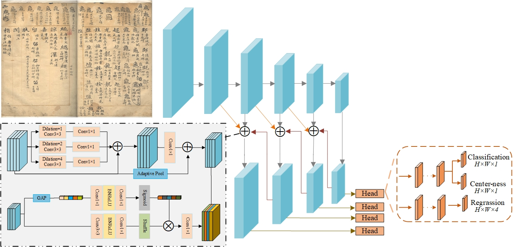

## Ancient Manuscript Detection: Multi-Scale Character Consistency Position Estimation


## Description
This is the official implementation for our paper [Ancient Manuscript Detection: Multi-Scale Character Consistency Position Estimation]. Text detection is crucial for the digitization of historical document images. Unlike scene text detection, which faces challenges like occlusion and bending, historical documents are often impacted by degradation factors such as folds, seal coverage, and ink bleeding. Additionally, the complex layout and dense text of ancient books further complicate detection. To address these issues, we propose a novel method for historical document image detection. First, we design a binary network to minimize noise in complex layouts. Next, we develop an enhanced text detector based on the FCOS model and incorporate self-calibrated convolution into the encoder to strengthen text foreground features while effectively reducing background noise. A bottom-up fusion path is also introduced in the decoder to enhance the detection of multi-scale dense text. Furthermore, we present an improved Non-Maximum Suppression (NMS) algorithm with a weighting mechanism that combines text information from both binarized and original images to increase detection accuracy. Experimental results on the MTHv2, IHR_NomDB, and VLM_HD public datasets demonstrate that our method outperforms existing mainstream text detectors across multiple metrics, confirming its superiority.

## Models
## Prerequisites
- Linux (Ubuntu)/Windows
- Python >= 3.8
- NVIDIA GPU + CUDA CuDNN

You can get the data set you need for training from the links below, and use the utils toolkit to capture image patches, 
as well as get edge maps and mask maps. With all this ready, 
you can run the training script (train.py).

- Train a model per datasets
```bash
python3 train_coco.py
```

- Evaluate the model per datasets
<!--
(our pre-trained models are in ./pretrained_model)
- We plan to upload the pre-trained models on our Github page.
-->
```bash
python3 weighted_nms.py
```
